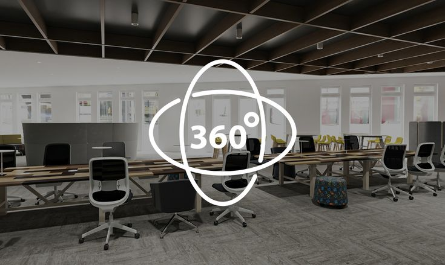
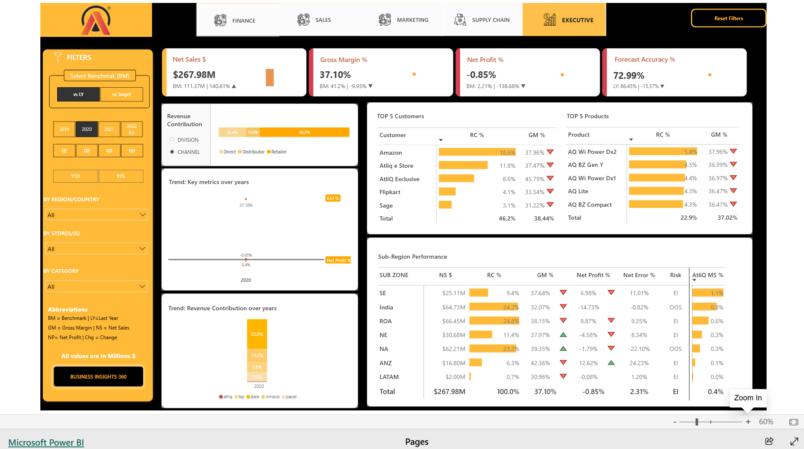

---

# **Business Insights 360**: Transforming Data into Decisions.  

Welcome to the **Business Insights 360** Power BI project repository! This dynamic dashboard empowers AtliQ Hardware with actionable insights spanning Finance, Sales, Marketing, Supply Chain, and Executive Decision-Making.  

## **Overview**  
**Business Insights 360** is more than just a dashboard—it's a game-changer for AtliQ Hardware, a company specializing in computer hardware sales. By combining data from multiple sources, this dashboard delivers powerful analytics to uncover key business insights, optimize strategies, and drive growth.  

## **Features**  
- **Finance View**: Analyze revenue, expenses, profit margins, and ROI.  
- **Sales View**: Gain insights into product and customer performance.  
- **Marketing View**: Enhance marketing strategies with data-driven analytics.  
- **Supply Chain View**: Optimize supply chain efficiency with actionable metrics.  
- **Executive View**: Provide top-level executives with critical business KPIs.  
> ### **Executive View >>>**

## Live Dashboard
Explore the live dashboard [HERE](https://app.powerbi.com/view?r=eyJrIjoiMzJkODEzZjUtMWJmZC00YjMyLWJlYzYtZjJmZTJjMGE0OWU4IiwidCI6ImM2ZTU0OWIzLTVmNDUtNDAzMi1hYWU5LWQ0MjQ0ZGM1YjJjNCJ9).

##  **Key Achievements**  
- **Customization**: Tailored to meet AtliQ Hardware's unique needs.  
- **Data Integration**: Unified Excel, CSV, and MySQL data sources seamlessly.  
- **Visualizations**: Engaging and easy-to-understand charts and visuals.  
- **Performance Optimization**: Achieved a 5% increase in reporting efficiency through DAX Studio and best practices.  
 
## Data Sources
The dashboard seamlessly collects and utilizes data from two primary sources:

1. **Excel/CSV Files:** Targets, Market Share data, and related information are sourced from [Excel/CSV files](https://github.com/pradeep-the-analyst/BI-360/tree/main/Assets/Excel_CSV_Files).
   
2. **MySQL Database:** Facts and Dimensions for all departments are retrieved from a [MySQL database](https://github.com/pradeep-the-analyst/BI-360/tree/main/Assets/MySQL_Database).

### Prerequisites
- [Power BI Desktop](https://powerbi.microsoft.com/desktop/)
- [DAX Studio](https://daxstudio.org/) 

##  **Explore, Analyze, Decide!**  
Dive into **Business Insights 360** and empower your decision-making with data-driven insights.  

---

